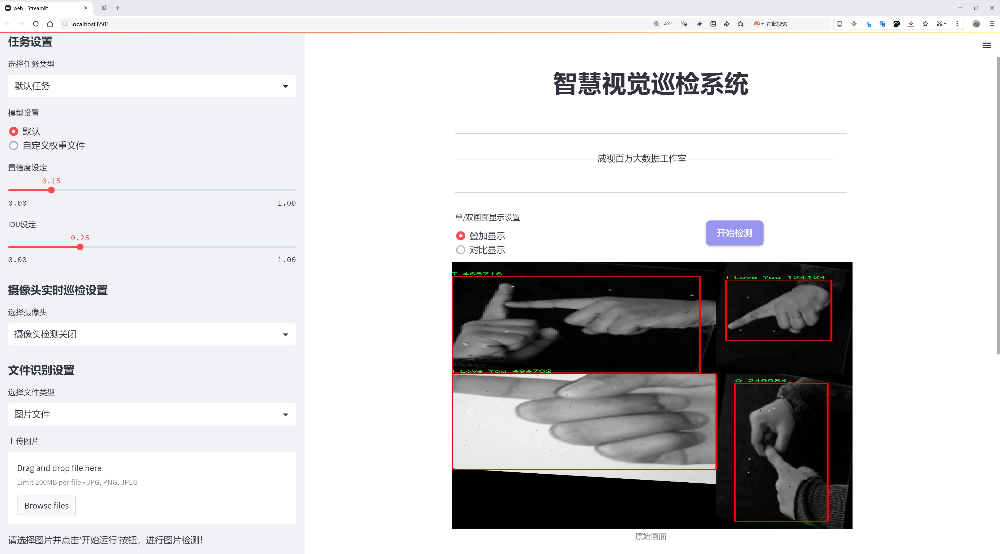
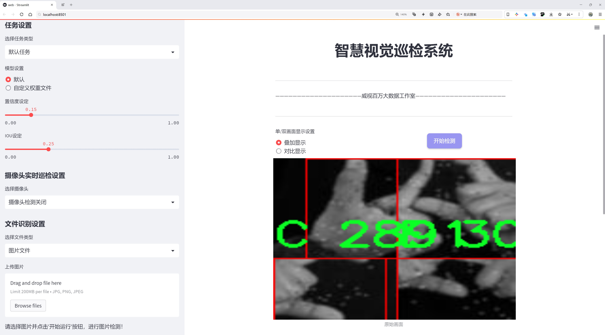
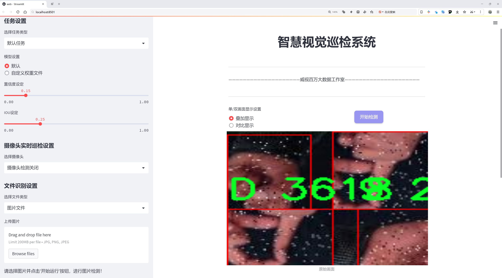
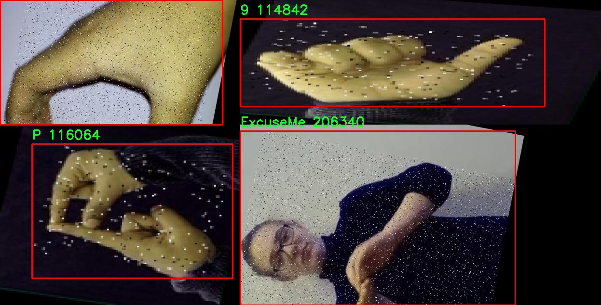
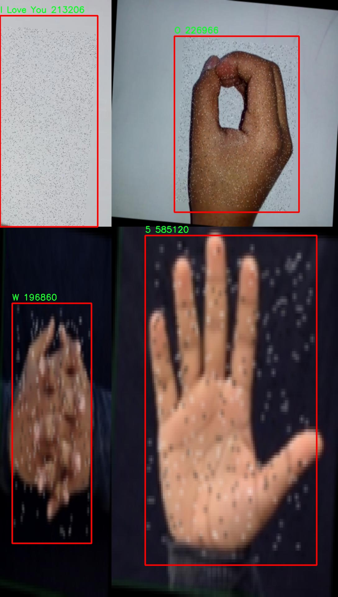
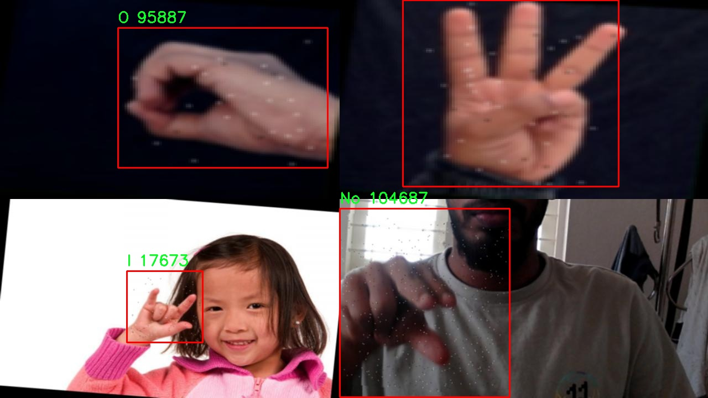
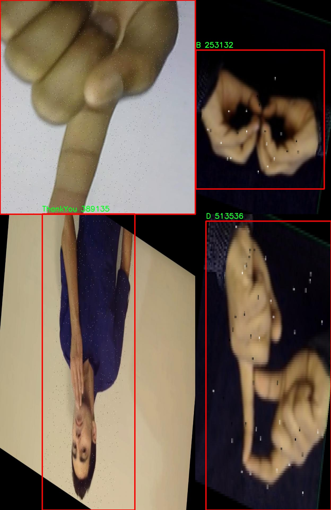
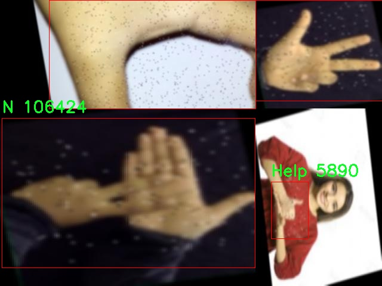

# 手势与标志识别检测系统源码分享
 # [一条龙教学YOLOV8标注好的数据集一键训练_70+全套改进创新点发刊_Web前端展示]

### 1.研究背景与意义

项目参考[AAAI Association for the Advancement of Artificial Intelligence](https://gitee.com/qunmasj/projects)

研究背景与意义

随着人工智能技术的迅猛发展，计算机视觉领域的研究逐渐成为了学术界和工业界的热点。手势与标志识别作为计算机视觉的重要应用之一，具有广泛的应用前景，尤其是在智能交互、辅助驾驶、智能家居和人机交互等领域。手势和标志不仅是人类交流的重要方式，也是机器理解人类意图的关键。为了实现更为精准和高效的手势与标志识别，研究者们不断探索新的算法和模型，以提升识别的准确性和实时性。

在众多目标检测算法中，YOLO（You Only Look Once）系列模型因其优越的实时性和高效性而备受关注。YOLOv8作为该系列的最新版本，进一步优化了检测精度和速度，适用于多种复杂场景。然而，尽管YOLOv8在目标检测任务中表现出色，但在特定应用场景下，如手势与标志识别，仍存在一些不足之处。例如，模型在处理复杂背景、不同光照条件以及多样化手势和标志时，可能会出现识别率下降的问题。因此，基于改进YOLOv8的手势与标志识别系统的研究具有重要的理论价值和实际意义。

本研究将以一个包含2069张图像和45个类别的手势与标志数据集为基础，深入探讨如何通过改进YOLOv8模型来提升手势与标志的识别能力。该数据集涵盖了从数字（1-9）到字母（A-Z）以及常用短语（如“Hello”、“Thank You”等）的多种类别，提供了丰富的样本用于训练和测试。这种多样性不仅能够帮助模型学习到更为全面的特征，还能提高其在实际应用中的适应性和鲁棒性。

通过对YOLOv8模型的改进，我们期望能够在以下几个方面取得突破：首先，增强模型对复杂背景和多变光照条件的适应能力，提高其在真实场景中的识别准确率；其次，优化模型的推理速度，以满足实时应用的需求；最后，探索数据增强和迁移学习等技术，进一步提升模型的泛化能力和识别性能。

本研究的意义不仅在于提升手势与标志识别的技术水平，更在于推动人机交互的智能化进程。随着智能设备的普及，用户对自然交互方式的需求日益增加，手势与标志识别技术的进步将为实现更为自然和高效的人机交互提供有力支持。此外，研究成果还可以为其他领域的目标检测任务提供借鉴，推动计算机视觉技术的进一步发展。

综上所述，基于改进YOLOv8的手势与标志识别系统的研究，既是对现有技术的挑战与创新，也是对未来智能交互方式的探索与实践，具有重要的学术价值和应用前景。

### 2.图片演示







##### 注意：由于此博客编辑较早，上面“2.图片演示”和“3.视频演示”展示的系统图片或者视频可能为老版本，新版本在老版本的基础上升级如下：（实际效果以升级的新版本为准）

  （1）适配了YOLOV8的“目标检测”模型和“实例分割”模型，通过加载相应的权重（.pt）文件即可自适应加载模型。

  （2）支持“图片识别”、“视频识别”、“摄像头实时识别”三种识别模式。

  （3）支持“图片识别”、“视频识别”、“摄像头实时识别”三种识别结果保存导出，解决手动导出（容易卡顿出现爆内存）存在的问题，识别完自动保存结果并导出到。

  （4）支持Web前端系统中的标题、背景图等自定义修改，后面提供修改教程。

  另外本项目提供训练的数据集和训练教程,暂不提供权重文件（best.pt）,需要您按照教程进行训练后实现图片演示和Web前端界面演示的效果。

### 3.视频演示

[3.1 视频演示](https://www.bilibili.com/video/BV1PxsLeBEPL/?vd_source=ff015de2d29cbe2a9cdbfa7064407a08)

### 4.数据集信息展示

数据集信息展示

本数据集名为“signs”，专为改进YOLOv8的手势与标志识别系统而设计，旨在提升计算机视觉领域对手势和标志的识别能力。该数据集包含2069幅图像，涵盖了45个不同的类别，这些类别不仅包括数字（1-9）和字母（A-Z），还包括一些特定的手势和标志，如“ExcuseMe”、“Help”、“I Love You”等。这种多样化的类别设置使得模型能够在多种场景下进行有效的识别和分类，具有广泛的应用潜力。

数据集中每个类别的设计都经过精心挑选，以确保涵盖常见的手势和标志，满足不同用户的需求。例如，数字类别（1-9）可以用于基础的计数和排序任务，而字母类别（A-Z）则适用于字母拼写和信息传递的场景。特殊手势如“Thank You”、“Please”和“Excuse Me”则为日常交流提供了更多的便利，尤其是在需要无声沟通的环境中。

在图像的采集过程中，数据集的多样性得到了充分考虑。图像来源于不同的背景、光照条件和手势执行者，这样的多样性确保了模型在训练过程中能够学习到更为丰富的特征，进而提升其在实际应用中的鲁棒性和准确性。数据集的图像质量也经过严格筛选，以确保每幅图像都能够清晰地展示手势或标志的细节，帮助模型更好地进行特征提取。

此外，数据集的许可采用了CC BY 4.0，这意味着用户可以自由地使用、分享和修改数据集，只需适当归属原作者。这种开放的许可政策促进了学术界和工业界的合作，鼓励更多的研究者和开发者参与到手势与标志识别技术的研究和应用中来。

在模型训练过程中，YOLOv8将利用这一数据集进行特征学习和参数优化。通过对大量标注图像的学习，模型能够逐步掌握手势和标志的识别技巧，进而实现实时的检测与分类。这一过程不仅需要强大的计算能力，还需要合理的训练策略，以确保模型能够在不同的应用场景中保持高效的识别性能。

总之，数据集“signs”不仅为YOLOv8的手势与标志识别系统提供了丰富的训练素材，也为相关领域的研究提供了宝贵的数据支持。随着技术的不断进步和应用场景的不断扩展，基于这一数据集训练出的模型将有望在智能家居、无障碍沟通、教育等多个领域发挥重要作用。通过不断优化和迭代，手势与标志识别技术的未来将更加光明。











### 5.全套项目环境部署视频教程（零基础手把手教学）

[5.1 环境部署教程链接（零基础手把手教学）](https://www.ixigua.com/7404473917358506534?logTag=c807d0cbc21c0ef59de5)


[5.2 安装Python虚拟环境创建和依赖库安装视频教程链接（零基础手把手教学）](https://www.ixigua.com/7404474678003106304?logTag=1f1041108cd1f708b01a)

### 6.手把手YOLOV8训练视频教程（零基础小白有手就能学会）

[6.1 环境部署教程链接（零基础手把手教学）](https://www.ixigua.com/7404477157818401292?logTag=d31a2dfd1983c9668658)

### 7.70+种全套YOLOV8创新点代码加载调参视频教程（一键加载写好的改进模型的配置文件）

[7.1 环境部署教程链接（零基础手把手教学）](https://www.ixigua.com/7404478314661806627?logTag=29066f8288e3f4eea3a4)

### 8.70+种全套YOLOV8创新点原理讲解（非科班也可以轻松写刊发刊，V10版本正在科研待更新）

由于篇幅限制，每个创新点的具体原理讲解就不一一展开，具体见下列网址中的创新点对应子项目的技术原理博客网址【Blog】：


[8.1 70+种全套YOLOV8创新点原理讲解链接](https://gitee.com/qunmasj/good)

### 9.系统功能展示（检测对象为举例，实际内容以本项目数据集为准）

图1.系统支持检测结果表格显示

  图2.系统支持置信度和IOU阈值手动调节

  图3.系统支持自定义加载权重文件best.pt(需要你通过步骤5中训练获得)

  图4.系统支持摄像头实时识别

  图5.系统支持图片识别

  图6.系统支持视频识别

  图7.系统支持识别结果文件自动保存

  图8.系统支持Excel导出检测结果数据


### 10.原始YOLOV8算法原理

原始YOLOv8算法原理

YOLOv8作为目标检测领域的最新进展，继承并扩展了YOLO系列算法的优良传统，其设计理念围绕着高效性、准确性和易用性展开。该算法的核心结构依然由输入层、主干网络、特征融合层和解耦头组成，但在此基础上进行了诸多创新和改进，使其在处理复杂场景时表现得更加出色。

在主干网络部分，YOLOv8延续了YOLOv5的CSPDarknet架构，但对其进行了优化，特别是将C3模块替换为C2f模块。C2f模块的设计灵感来源于YOLOv7的ELAN思想，采用了更为灵活的特征流分支结构。C2f模块不仅通过引入多个分支来增强梯度流的丰富性，还在特征提取过程中保持了输入和输出通道的尺寸一致性。这种设计有效地缓解了深层网络中的梯度消失问题，同时提升了浅层特征的重用率，从而提高了整体的检测精度。

YOLOv8的特征融合层采用了PAN-FPN结构，这一结构的优势在于能够实现多尺度特征的高效融合。具体而言，YOLOv8在特征融合过程中，首先将高层特征通过上采样与中层特征进行连接，随后再与浅层特征进行融合。这种自下而上的融合方式确保了不同层次特征的有效结合，使得模型在检测小目标时能够获得更为细致的语义信息和上下文信息，从而提高了检测的准确性。

值得注意的是，YOLOv8在目标检测方法上进行了根本性的变革，抛弃了传统的Anchor-Base策略，转而采用Anchor-Free的设计理念。这一变化使得YOLOv8在处理目标检测任务时，不再依赖于预设的锚框，而是将目标检测视为关键点检测问题。通过这种方式，YOLOv8能够在不同的场景中展现出更强的泛化能力和灵活性，尤其是在面对多样化的目标形状和大小时，表现得尤为突出。

在损失函数的设计上，YOLOv8引入了VFLLoss和DFLLoss+CIoULoss组合，以优化分类和回归的效果。VFLLoss作为分类损失函数，能够有效处理样本不平衡的问题，而DFLLoss则通过积分形式的表示法来增强回归的准确性。CIoULoss则在边界框回归中提供了更为精确的度量，使得模型在训练过程中能够更快地聚焦于目标的真实位置，从而提高了检测精度。

YOLOv8的样本匹配策略也经历了显著的改进，采用了Task-Aligned的Assigner匹配方式。这一策略通过动态调整样本匹配过程，确保了模型在训练过程中能够更好地适应不同的任务需求，从而提升了整体的学习效率。

在数据预处理方面，YOLOv8继续沿用了YOLOv5的策略，采用了多种数据增强技术，如马赛克增强、混合增强、空间扰动和颜色扰动等。这些增强手段不仅丰富了训练样本的多样性，还有效提高了模型的鲁棒性，使其在面对复杂场景时能够保持良好的检测性能。

总的来说，YOLOv8通过对主干网络、特征融合层、目标检测方法和损失函数等多个方面的创新与优化，展现出了在目标检测任务中的卓越性能。其灵活的架构设计和高效的特征提取能力，使得YOLOv8在处理各种复杂场景时，能够以更高的精度和更快的速度完成目标检测任务。这些改进不仅提升了YOLOv8的实用性，也为未来的目标检测研究提供了新的思路和方向。


### 11.项目核心源码讲解（再也不用担心看不懂代码逻辑）

#### 11.1 ultralytics\engine\trainer.py

以下是经过精简和注释的核心代码部分，主要保留了模型训练的关键逻辑和功能：

```python
import os
import time
import torch
from torch import distributed as dist
from torch import nn, optim
from ultralytics.cfg import get_cfg, get_save_dir
from ultralytics.utils import LOGGER, RANK, callbacks
from ultralytics.utils.torch_utils import EarlyStopping, select_device

class BaseTrainer:
    """
    BaseTrainer 类用于训练模型的基类。
    """

    def __init__(self, cfg=None, overrides=None):
        """
        初始化 BaseTrainer 类。

        Args:
            cfg (str, optional): 配置文件路径，默认为 None。
            overrides (dict, optional): 配置覆盖，默认为 None。
        """
        self.args = get_cfg(cfg, overrides)  # 获取配置
        self.device = select_device(self.args.device)  # 选择设备
        self.model = self.load_model(self.args.model)  # 加载模型
        self.optimizer = self.build_optimizer()  # 构建优化器
        self.epochs = self.args.epochs  # 训练轮数
        self.start_epoch = 0  # 起始轮数
        self.callbacks = callbacks.get_default_callbacks()  # 获取默认回调

    def load_model(self, model_path):
        """加载模型"""
        model = torch.load(model_path)  # 加载模型
        return model

    def build_optimizer(self):
        """构建优化器"""
        optimizer = optim.Adam(self.model.parameters(), lr=self.args.lr)  # 使用 Adam 优化器
        return optimizer

    def train(self):
        """开始训练过程"""
        for epoch in range(self.start_epoch, self.epochs):
            self.model.train()  # 设置模型为训练模式
            for batch in self.get_dataloader():  # 获取数据加载器
                self.optimizer.zero_grad()  # 清空梯度
                loss = self.model(batch)  # 前向传播
                loss.backward()  # 反向传播
                self.optimizer.step()  # 更新参数
                self.run_callbacks("on_train_batch_end")  # 运行批次结束的回调

            self.run_callbacks("on_train_epoch_end")  # 运行轮次结束的回调

    def get_dataloader(self):
        """获取数据加载器"""
        # 此处应返回数据加载器的实例
        pass

    def run_callbacks(self, event):
        """运行与事件相关的回调"""
        for callback in self.callbacks.get(event, []):
            callback(self)

    def save_model(self):
        """保存模型的检查点"""
        torch.save(self.model.state_dict(), self.args.save_dir / "model.pt")  # 保存模型参数

# 示例用法
trainer = BaseTrainer(cfg='config.yaml')
trainer.train()  # 开始训练
```

### 代码说明
1. **BaseTrainer 类**：这是一个训练模型的基类，负责管理训练过程中的各个方面。
2. **初始化方法**：在初始化时加载配置、选择设备、加载模型和构建优化器。
3. **load_model 方法**：用于加载指定路径的模型。
4. **build_optimizer 方法**：构建一个 Adam 优化器。
5. **train 方法**：执行训练过程，循环遍历每个 epoch 和每个 batch，进行前向传播、反向传播和参数更新。
6. **get_dataloader 方法**：应返回数据加载器的实例（具体实现未提供）。
7. **run_callbacks 方法**：在训练过程中运行特定事件的回调函数。
8. **save_model 方法**：保存当前模型的状态字典到指定路径。

### 注意事项
- 代码中省略了一些具体实现细节，如数据加载器的实现、回调函数的具体内容等。
- 需要根据实际需求补充完整的功能实现。

这个文件是Ultralytics YOLO（You Only Look Once）框架中的一个训练器类，主要用于训练目标检测模型。它包含了模型训练的各个方面，包括模型的初始化、数据集的处理、训练过程的管理、模型的保存与恢复等功能。

首先，文件中定义了一个名为`BaseTrainer`的类，作为训练器的基类。该类的构造函数`__init__`接收配置参数并进行初始化，包括设置设备（CPU或GPU）、加载数据集、初始化模型、设置优化器等。它还会创建保存结果的目录，并将训练参数保存为YAML文件。

在训练过程中，`train`方法是主要的入口，负责管理训练的各个阶段。它会根据设备的数量选择合适的训练方式，如果是多GPU训练，则会设置分布式训练的参数。训练过程中会调用`_do_train`方法，该方法包含了训练的核心逻辑，包括每个epoch的训练、损失计算、优化器步骤等。

训练过程中，模型会通过`forward`方法进行前向传播，计算损失，并通过反向传播更新模型参数。为了提高训练效率，文件中还实现了自动混合精度（AMP）的支持，允许在训练中使用更高效的计算方式。

在每个epoch结束时，训练器会进行验证，评估模型的性能，并根据验证结果决定是否保存模型的检查点。模型的保存通过`save_model`方法实现，该方法会保存当前模型的状态、优化器的状态以及其他相关的训练信息。

此外，训练器还支持回调机制，可以在训练的不同阶段触发自定义的回调函数，例如在每个batch开始或结束时、每个epoch开始或结束时等。这使得用户可以在训练过程中插入自定义的逻辑，比如记录日志、绘制图表等。

文件中还包含了一些辅助方法，例如用于加载数据集、构建优化器、设置学习率调度器等。这些方法为训练过程提供了必要的支持，确保训练的顺利进行。

总的来说，这个文件是YOLO模型训练的核心部分，提供了全面的功能来管理训练过程，确保模型能够有效地学习和优化。

#### 11.2 ui.py

```python
import sys
import subprocess

def run_script(script_path):
    """
    使用当前 Python 环境运行指定的脚本。

    Args:
        script_path (str): 要运行的脚本路径

    Returns:
        None
    """
    # 获取当前 Python 解释器的路径
    python_path = sys.executable

    # 构建运行命令
    command = f'"{python_path}" -m streamlit run "{script_path}"'

    # 执行命令
    result = subprocess.run(command, shell=True)
    if result.returncode != 0:
        print("脚本运行出错。")


# 实例化并运行应用
if __name__ == "__main__":
    # 指定您的脚本路径
    script_path = "web.py"  # 这里可以直接指定脚本名称

    # 运行脚本
    run_script(script_path)
```

### 代码注释说明：

1. **导入模块**：
   - `import sys`：导入 sys 模块，用于访问与 Python 解释器紧密相关的变量和函数。
   - `import subprocess`：导入 subprocess 模块，用于创建新进程、连接到它们的输入/输出/错误管道，并获取返回码。

2. **定义函数 `run_script`**：
   - 该函数接受一个参数 `script_path`，表示要运行的 Python 脚本的路径。

3. **获取当前 Python 解释器的路径**：
   - `python_path = sys.executable`：获取当前正在使用的 Python 解释器的完整路径。

4. **构建运行命令**：
   - `command = f'"{python_path}" -m streamlit run "{script_path}"'`：使用 f-string 格式化字符串，构建运行指定脚本的命令。这里使用了 `streamlit` 模块来运行 web 应用。

5. **执行命令**：
   - `result = subprocess.run(command, shell=True)`：使用 subprocess.run() 方法执行构建的命令，并将结果存储在 `result` 变量中。
   - `if result.returncode != 0:`：检查命令的返回码，如果不为 0，表示脚本运行出错，打印错误信息。

6. **主程序入口**：
   - `if __name__ == "__main__":`：确保只有在直接运行该脚本时才会执行以下代码。
   - `script_path = "web.py"`：指定要运行的脚本名称。
   - `run_script(script_path)`：调用 `run_script` 函数，传入脚本路径以执行该脚本。

这个程序文件的主要功能是使用当前的 Python 环境来运行一个指定的脚本，具体是通过 Streamlit 框架来启动一个 Web 应用。程序的实现主要依赖于 Python 的标准库以及一个自定义的路径处理模块。

首先，程序导入了必要的模块，包括 `sys`、`os` 和 `subprocess`。`sys` 模块用于访问与 Python 解释器相关的变量和函数，`os` 模块提供了与操作系统交互的功能，而 `subprocess` 模块则用于创建新进程、连接到它们的输入/输出/错误管道，并获取它们的返回码。

接下来，程序定义了一个名为 `run_script` 的函数，该函数接受一个参数 `script_path`，表示要运行的脚本的路径。在函数内部，首先获取当前 Python 解释器的路径，存储在 `python_path` 变量中。然后，构建一个命令字符串，该命令使用当前的 Python 解释器和 Streamlit 模块来运行指定的脚本。具体来说，命令格式为 `"{python_path}" -m streamlit run "{script_path}"`。

之后，程序使用 `subprocess.run` 方法来执行构建好的命令。这个方法会在一个新的 shell 中运行命令，并等待命令执行完成。执行完成后，程序检查返回码，如果返回码不为 0，表示脚本运行出错，程序会输出一条错误信息。

在文件的最后部分，程序通过 `if __name__ == "__main__":` 语句来判断是否是直接运行该脚本。如果是，则指定要运行的脚本路径为 `web.py`，并调用 `run_script` 函数来执行这个脚本。

总的来说，这个程序的核心功能是通过当前的 Python 环境来运行一个 Streamlit 应用脚本，并处理可能出现的错误。

#### 11.3 ultralytics\models\yolo\classify\val.py

以下是经过简化和注释的核心代码部分：

```python
import torch
from ultralytics.data import ClassificationDataset, build_dataloader
from ultralytics.engine.validator import BaseValidator
from ultralytics.utils.metrics import ClassifyMetrics, ConfusionMatrix
from ultralytics.utils.plotting import plot_images

class ClassificationValidator(BaseValidator):
    """
    继承自BaseValidator类，用于基于分类模型的验证。
    """

    def __init__(self, dataloader=None, save_dir=None, pbar=None, args=None, _callbacks=None):
        """初始化ClassificationValidator实例，设置数据加载器、保存目录、进度条和参数。"""
        super().__init__(dataloader, save_dir, pbar, args, _callbacks)
        self.targets = None  # 存储真实标签
        self.pred = None     # 存储模型预测结果
        self.args.task = "classify"  # 设置任务类型为分类
        self.metrics = ClassifyMetrics()  # 初始化分类指标

    def init_metrics(self, model):
        """初始化混淆矩阵、类名及准确率指标。"""
        self.names = model.names  # 获取类名
        self.nc = len(model.names)  # 类别数量
        self.confusion_matrix = ConfusionMatrix(nc=self.nc, conf=self.args.conf, task="classify")  # 初始化混淆矩阵
        self.pred = []  # 初始化预测结果列表
        self.targets = []  # 初始化真实标签列表

    def preprocess(self, batch):
        """预处理输入批次并返回处理后的数据。"""
        batch["img"] = batch["img"].to(self.device, non_blocking=True)  # 将图像数据移动到设备上
        batch["img"] = batch["img"].half() if self.args.half else batch["img"].float()  # 根据参数选择数据类型
        batch["cls"] = batch["cls"].to(self.device)  # 将标签数据移动到设备上
        return batch

    def update_metrics(self, preds, batch):
        """使用模型预测和批次目标更新运行指标。"""
        n5 = min(len(self.names), 5)  # 取前5个预测结果
        self.pred.append(preds.argsort(1, descending=True)[:, :n5])  # 按照预测结果排序并取前n5
        self.targets.append(batch["cls"])  # 存储真实标签

    def finalize_metrics(self, *args, **kwargs):
        """最终化模型的指标，如混淆矩阵和速度。"""
        self.confusion_matrix.process_cls_preds(self.pred, self.targets)  # 处理预测结果和真实标签
        self.metrics.speed = self.speed  # 记录速度
        self.metrics.confusion_matrix = self.confusion_matrix  # 保存混淆矩阵
        self.metrics.save_dir = self.save_dir  # 保存目录

    def get_stats(self):
        """返回通过处理目标和预测得到的指标字典。"""
        self.metrics.process(self.targets, self.pred)  # 处理真实标签和预测结果
        return self.metrics.results_dict  # 返回结果字典

    def build_dataset(self, img_path):
        """根据给定的图像路径创建并返回ClassificationDataset实例。"""
        return ClassificationDataset(root=img_path, args=self.args, augment=False, prefix=self.args.split)

    def get_dataloader(self, dataset_path, batch_size):
        """构建并返回分类任务的数据加载器。"""
        dataset = self.build_dataset(dataset_path)  # 创建数据集
        return build_dataloader(dataset, batch_size, self.args.workers, rank=-1)  # 返回数据加载器

    def print_results(self):
        """打印YOLO模型的评估指标。"""
        pf = "%22s" + "%11.3g" * len(self.metrics.keys)  # 打印格式
        LOGGER.info(pf % ("all", self.metrics.top1, self.metrics.top5))  # 打印top1和top5准确率

    def plot_val_samples(self, batch, ni):
        """绘制验证图像样本。"""
        plot_images(
            images=batch["img"],
            batch_idx=torch.arange(len(batch["img"])),
            cls=batch["cls"].view(-1),  # 使用.view()而不是.squeeze()来处理分类模型
            fname=self.save_dir / f"val_batch{ni}_labels.jpg",
            names=self.names,
            on_plot=self.on_plot,
        )

    def plot_predictions(self, batch, preds, ni):
        """在输入图像上绘制预测结果并保存结果。"""
        plot_images(
            batch["img"],
            batch_idx=torch.arange(len(batch["img"])),
            cls=torch.argmax(preds, dim=1),  # 获取预测的类别
            fname=self.save_dir / f"val_batch{ni}_pred.jpg",
            names=self.names,
            on_plot=self.on_plot,
        )
```

### 代码核心部分说明：
1. **类的定义**：`ClassificationValidator` 继承自 `BaseValidator`，用于分类模型的验证。
2. **初始化方法**：设置必要的参数，包括数据加载器、保存目录、进度条等。
3. **指标初始化**：初始化混淆矩阵和分类指标。
4. **数据预处理**：将输入批次的数据转移到设备上，并根据需要转换数据类型。
5. **更新指标**：根据模型的预测结果和真实标签更新分类指标。
6. **最终化指标**：处理并保存混淆矩阵和其他性能指标。
7. **数据集和数据加载器**：构建数据集和数据加载器，以便进行批量处理。
8. **结果打印和绘图**：打印评估结果，并绘制验证样本和预测结果。

这个程序文件是Ultralytics YOLO框架中的一个用于分类模型验证的类，名为`ClassificationValidator`。它继承自`BaseValidator`类，主要用于处理分类任务的验证过程。

首先，文件导入了一些必要的库和模块，包括PyTorch和Ultralytics框架中的数据处理、验证器、日志记录、指标计算和图像绘制等功能模块。接着，`ClassificationValidator`类的构造函数`__init__`初始化了一些基本参数，包括数据加载器、保存目录、进度条和其他参数。它还设置了任务类型为“分类”，并初始化了分类指标的实例。

`get_desc`方法返回一个格式化的字符串，用于总结分类指标，包括类别名称、Top-1准确率和Top-5准确率。`init_metrics`方法用于初始化混淆矩阵、类别名称和准确率等指标。`preprocess`方法对输入的批次数据进行预处理，将图像和类别标签移动到指定的设备上，并根据需要转换数据类型。

`update_metrics`方法在每个批次处理后更新模型的预测结果和目标标签，记录Top-5的预测结果。`finalize_metrics`方法在所有批次处理完成后，处理混淆矩阵并更新模型的速度和其他指标。如果设置了绘图选项，它还会绘制混淆矩阵的可视化图。

`get_stats`方法返回一个包含处理后的目标和预测结果的指标字典。`build_dataset`方法根据给定的图像路径和参数创建并返回一个`ClassificationDataset`实例。`get_dataloader`方法则构建并返回一个数据加载器，以便于在分类任务中使用。

`print_results`方法用于打印YOLO模型的评估指标，包括整体的Top-1和Top-5准确率。`plot_val_samples`和`plot_predictions`方法用于绘制验证图像样本和预测结果，并将结果保存到指定的目录中。

总的来说，这个文件实现了分类模型验证的完整流程，包括数据加载、预处理、指标计算、结果打印和可视化等功能，旨在帮助用户评估分类模型的性能。

#### 11.4 ultralytics\engine\model.py

以下是经过简化并注释的核心代码部分，主要保留了模型的初始化、加载、预测等功能，并对每个方法进行了详细的中文注释：

```python
import inspect
import sys
from pathlib import Path
from typing import Union
from ultralytics.nn import nn  # 导入神经网络模块

class Model(nn.Module):
    """
    统一所有模型API的基础类。

    参数:
        model (str, Path): 要加载或创建的模型文件路径。
        task (Any, optional): YOLO模型的任务类型。默认为None。
    """

    def __init__(self, model: Union[str, Path] = "yolov8n.pt", task=None, verbose=False) -> None:
        """
        初始化YOLO模型。

        参数:
            model (Union[str, Path], optional): 要加载或创建的模型路径或名称。默认为'yolov8n.pt'。
            task (Any, optional): YOLO模型的任务类型。默认为None。
            verbose (bool, optional): 是否启用详细模式。
        """
        super().__init__()
        self.model = None  # 模型对象
        self.task = task  # 任务类型
        self.model_name = str(model).strip()  # 去除模型名称的空格

        # 加载或创建新的YOLO模型
        model = self._check_model_file(model)  # 检查模型文件
        if Path(model).suffix in (".yaml", ".yml"):
            self._new(model, task=task, verbose=verbose)  # 从配置文件创建新模型
        else:
            self._load(model, task=task)  # 从权重文件加载模型

    def _check_model_file(self, model: str) -> str:
        """检查并返回模型文件的完整路径。"""
        # 这里可以添加检查模型文件后缀的逻辑
        return model + ".pt"  # 假设默认后缀为.pt

    def _new(self, cfg: str, task=None, verbose=False):
        """
        初始化新模型并根据模型定义推断任务类型。

        参数:
            cfg (str): 模型配置文件
            task (str | None): 模型任务
            verbose (bool): 加载时显示模型信息
        """
        # 加载配置文件并创建模型
        self.cfg = cfg
        self.task = task  # 设置任务类型
        self.model = self._create_model(cfg)  # 创建模型

    def _create_model(self, cfg: str):
        """根据配置文件创建模型。"""
        # 这里可以添加创建模型的逻辑
        return nn.Module()  # 返回一个新的模型实例

    def _load(self, weights: str, task=None):
        """
        从权重文件加载模型并推断任务类型。

        参数:
            weights (str): 要加载的模型检查点
            task (str | None): 模型任务
        """
        # 加载权重文件并设置任务类型
        self.model = self._load_weights(weights)  # 加载权重
        self.task = task  # 设置任务类型

    def _load_weights(self, weights: str):
        """加载权重文件并返回模型。"""
        # 这里可以添加加载权重的逻辑
        return nn.Module()  # 返回加载后的模型实例

    def predict(self, source=None, stream=False, **kwargs):
        """
        使用YOLO模型进行预测。

        参数:
            source (str | int | PIL | np.ndarray): 进行预测的图像来源。
            stream (bool): 是否流式传输预测结果。默认为False。
            **kwargs : 传递给预测器的其他关键字参数。

        返回:
            (List[ultralytics.engine.results.Results]): 预测结果。
        """
        if source is None:
            source = "default_source"  # 默认来源
        # 进行预测的逻辑
        return self.model.predict(source, stream, **kwargs)  # 调用模型的预测方法

    def info(self, detailed=False, verbose=True):
        """
        记录模型信息。

        参数:
            detailed (bool): 是否显示详细信息。
            verbose (bool): 控制详细程度。
        """
        # 记录模型信息的逻辑
        return self.model.info(detailed=detailed, verbose=verbose)  # 调用模型的信息方法
```

### 代码说明：
1. **Model类**：这是一个继承自`nn.Module`的基础类，用于统一YOLO模型的API。
2. **初始化方法**：在初始化时，检查模型文件并决定是加载已有模型还是创建新模型。
3. **_new和_load方法**：分别用于创建新模型和加载已有模型的权重。
4. **predict方法**：实现了使用YOLO模型进行预测的功能。
5. **info方法**：用于记录和输出模型的信息。

该代码的核心功能是模型的加载和预测，其他辅助方法如模型信息记录等也被保留以供使用。

这个程序文件是一个实现YOLO（You Only Look Once）模型的基础类，主要用于统一不同模型的API。文件中定义了一个`Model`类，包含了模型的初始化、加载、预测、训练等多种功能。

在类的构造函数`__init__`中，用户可以传入模型文件的路径或名称、任务类型以及是否启用详细模式。构造函数首先会检查模型是否来自Ultralytics HUB或Triton Server，如果是，则相应地处理。接着，程序会根据传入的模型文件后缀判断是加载已有模型还是创建新模型，并调用相应的方法进行处理。

类中定义了多个方法，`__call__`方法允许用户直接调用模型实例进行预测，实际上是调用了`predict`方法。`_new`和`_load`方法分别用于初始化新模型和加载已有模型的权重，并推断任务类型。`_check_is_pytorch_model`方法用于检查当前模型是否为PyTorch模型，若不是则抛出错误。

模型的重置、信息日志、融合、嵌入、预测、跟踪、验证、基准测试、导出和训练等功能都通过相应的方法实现。每个方法都包含详细的参数说明，允许用户根据需要传入不同的参数进行操作。例如，`predict`方法可以接受多种类型的输入源，并返回预测结果。

此外，类中还定义了一些辅助方法，例如用于添加和清除回调函数的方法，以及重置回调的功能。`task_map`属性用于映射不同任务类型到相应的模型、训练器、验证器和预测器类，但具体的映射需要用户提供。

总的来说，这个文件提供了一个灵活且功能丰富的框架，使得用户能够方便地使用YOLO模型进行各种计算机视觉任务。

#### 11.5 train.py

以下是经过简化和注释的核心代码部分：

```python
import os
import torch
import yaml
from ultralytics import YOLO  # 导入YOLO模型库
from QtFusion.path import abs_path  # 导入路径处理函数

# 确定使用的设备，优先使用GPU
device = "0" if torch.cuda.is_available() else "cpu"

if __name__ == '__main__':  # 确保该模块被直接运行时才执行以下代码
    # 设置工作进程数和批次大小
    workers = 1
    batch = 2

    # 数据集名称
    data_name = "data"
    # 获取数据集配置文件的绝对路径
    data_path = abs_path(f'datasets/{data_name}/{data_name}.yaml', path_type='current')
    
    # 获取数据集目录路径
    directory_path = os.path.dirname(data_path)
    
    # 读取YAML文件
    with open(data_path, 'r') as file:
        data = yaml.load(file, Loader=yaml.FullLoader)
    
    # 修改YAML文件中的路径项
    if 'path' in data:
        data['path'] = directory_path
        # 将修改后的数据写回YAML文件
        with open(data_path, 'w') as file:
            yaml.safe_dump(data, file, sort_keys=False)

    # 加载YOLOv8模型
    model = YOLO(model='./ultralytics/cfg/models/v8/yolov8s.yaml', task='detect')
    
    # 开始训练模型
    results2 = model.train(
        data=data_path,  # 指定训练数据的配置文件路径
        device=device,  # 指定训练使用的设备
        workers=workers,  # 指定使用的工作进程数
        imgsz=640,  # 输入图像的大小
        epochs=100,  # 训练的轮数
        batch=batch,  # 每个批次的大小
        name='train_v8_' + data_name  # 训练任务的名称
    )
```

### 代码注释说明：
1. **导入库**：导入必要的库，包括操作系统库、PyTorch、YAML解析库和YOLO模型库。
2. **设备选择**：检查是否有可用的GPU，如果有则使用GPU，否则使用CPU。
3. **主程序入口**：确保代码块只在直接运行时执行。
4. **参数设置**：设置工作进程数和批次大小。
5. **数据集路径**：定义数据集名称并获取其配置文件的绝对路径。
6. **读取和修改YAML文件**：读取YAML文件，修改其中的路径项，然后将修改后的内容写回文件。
7. **模型加载**：加载YOLOv8模型，准备进行目标检测任务。
8. **模型训练**：调用模型的训练方法，传入数据路径、设备、工作进程数、图像大小、训练轮数、批次大小和任务名称等参数。

这个程序文件 `train.py` 是一个用于训练 YOLOv8 模型的脚本。首先，它导入了必要的库，包括 `os`、`torch`、`yaml` 和 `ultralytics` 中的 YOLO 模型。接着，它根据系统是否支持 CUDA 来选择设备，如果支持则使用 GPU（设备编号为 "0"），否则使用 CPU。

在 `if __name__ == '__main__':` 语句下，程序确保只有在直接运行该脚本时才会执行以下代码。首先，定义了工作进程数量 `workers` 和批次大小 `batch`。接着，设置了数据集的名称为 "data"，并构建了数据集 YAML 文件的绝对路径。通过 `abs_path` 函数获取路径，并将系统路径分隔符替换为 Unix 风格的斜杠。

程序接下来获取了数据集目录的路径，并打开 YAML 文件以读取数据。使用 `yaml.load` 函数读取 YAML 文件内容，并保持原有顺序。然后，检查数据中是否包含 `path` 项，如果有，则将其修改为目录路径，并将更新后的数据写回 YAML 文件中，确保路径的正确性。

随后，程序加载了预训练的 YOLOv8 模型，指定了模型配置文件的路径。接下来，调用 `model.train` 方法开始训练模型。在训练过程中，指定了训练数据的配置文件路径、设备、工作进程数量、输入图像的大小（640x640）、训练的 epoch 数量（100）以及训练任务的名称（以 "train_v8_" 开头，后接数据集名称）。

整个程序的主要功能是配置并启动 YOLOv8 模型的训练过程，确保数据路径的正确性，并设置训练的相关参数。

#### 11.6 ultralytics\models\yolo\model.py

```python
# Ultralytics YOLO 🚀, AGPL-3.0 license

from ultralytics.engine.model import Model  # 导入基础模型类
from ultralytics.models import yolo  # 导入YOLO模型相关模块

class YOLO(Model):
    """YOLO (You Only Look Once) 目标检测模型。"""

    @property
    def task_map(self):
        """将任务类型映射到相应的模型、训练器、验证器和预测器类。"""
        return {
            "classify": {  # 分类任务
                "model": ClassificationModel,  # 分类模型
                "trainer": yolo.classify.ClassificationTrainer,  # 分类训练器
                "validator": yolo.classify.ClassificationValidator,  # 分类验证器
                "predictor": yolo.classify.ClassificationPredictor,  # 分类预测器
            },
            "detect": {  # 检测任务
                "model": DetectionModel,  # 检测模型
                "trainer": yolo.detect.DetectionTrainer,  # 检测训练器
                "validator": yolo.detect.DetectionValidator,  # 检测验证器
                "predictor": yolo.detect.DetectionPredictor,  # 检测预测器
            },
            "segment": {  # 分割任务
                "model": SegmentationModel,  # 分割模型
                "trainer": yolo.segment.SegmentationTrainer,  # 分割训练器
                "validator": yolo.segment.SegmentationValidator,  # 分割验证器
                "predictor": yolo.segment.SegmentationPredictor,  # 分割预测器
            },
            "pose": {  # 姿态估计任务
                "model": PoseModel,  # 姿态模型
                "trainer": yolo.pose.PoseTrainer,  # 姿态训练器
                "validator": yolo.pose.PoseValidator,  # 姿态验证器
                "predictor": yolo.pose.PosePredictor,  # 姿态预测器
            },
            "obb": {  # 方向边界框任务
                "model": OBBModel,  # 方向边界框模型
                "trainer": yolo.obb.OBBTrainer,  # 方向边界框训练器
                "validator": yolo.obb.OBBValidator,  # 方向边界框验证器
                "predictor": yolo.obb.OBBPredictor,  # 方向边界框预测器
            },
        }
```

### 代码核心部分注释说明：
1. **YOLO类**：继承自基础模型类`Model`，用于实现YOLO目标检测模型的功能。
2. **task_map属性**：该属性返回一个字典，映射不同的任务类型（如分类、检测、分割、姿态估计和方向边界框）到相应的模型、训练器、验证器和预测器。这使得模型可以根据不同的任务类型动态选择相应的组件。

这个程序文件定义了一个名为 `YOLO` 的类，继承自 `Model` 类，主要用于实现 YOLO（You Only Look Once）目标检测模型。文件开头的注释表明该代码遵循 AGPL-3.0 许可证。

在 `YOLO` 类中，有一个名为 `task_map` 的属性方法。这个方法返回一个字典，字典的键是不同的任务类型，如分类（classify）、检测（detect）、分割（segment）、姿态估计（pose）和有向边界框（obb）。每个任务类型对应一个子字典，其中包含模型、训练器、验证器和预测器的类。

具体来说，对于每种任务，`task_map` 返回的子字典包含以下内容：
- `model`：对应的模型类，例如分类任务使用 `ClassificationModel`，检测任务使用 `DetectionModel`，依此类推。
- `trainer`：对应的训练器类，用于训练模型。
- `validator`：对应的验证器类，用于验证模型的性能。
- `predictor`：对应的预测器类，用于进行模型预测。

通过这种方式，`YOLO` 类能够灵活地映射不同的任务到相应的模型和处理类，便于在实际应用中进行调用和管理。这种设计使得 YOLO 模型能够支持多种计算机视觉任务，增强了其通用性和可扩展性。

### 12.系统整体结构（节选）

### 整体功能和构架概括

Ultralytics YOLO框架是一个用于目标检测和图像分类的深度学习模型库。该框架的整体功能包括模型的训练、验证、预测和可视化等。其构架由多个模块组成，每个模块负责特定的功能，使得整个系统具备良好的可扩展性和灵活性。

- **训练模块**：负责模型的训练过程，包括数据加载、损失计算、优化器设置等。
- **验证模块**：用于评估模型的性能，计算准确率、混淆矩阵等指标。
- **模型管理模块**：提供模型的定义、加载和预测功能，支持多种任务类型。
- **用户界面模块**：通过Streamlit等工具提供可视化界面，方便用户与模型交互。
- **工具模块**：包含错误处理、距离计算、热图生成等辅助功能。

### 文件功能整理表

| 文件路径                                         | 功能描述                                                 |
|--------------------------------------------------|----------------------------------------------------------|
| `ultralytics/engine/trainer.py`                 | 负责模型的训练过程，包括初始化、训练循环、验证和模型保存等功能。 |
| `ui.py`                                         | 启动一个Streamlit Web应用，用于用户界面交互和模型预测。   |
| `ultralytics/models/yolo/classify/val.py`      | 实现分类模型的验证过程，包括指标计算和结果可视化。      |
| `ultralytics/engine/model.py`                   | 定义YOLO模型的基础类，提供模型加载、预测和训练的统一接口。 |
| `train.py`                                      | 配置并启动YOLOv8模型的训练过程，设置数据路径和训练参数。 |
| `ultralytics/models/yolo/model.py`              | 定义YOLO类，映射不同任务类型到相应的模型、训练器和验证器。 |
| `ultralytics/utils/errors.py`                   | 处理框架中的错误和异常，提供统一的错误管理机制。        |
| `ultralytics/solutions/distance_calculation.py` | 提供距离计算的相关功能，可能用于目标检测中的物体距离估计。 |
| `ultralytics/nn/modules/__init__.py`           | 初始化神经网络模块，可能包含各种层和模型构建功能。      |
| `ultralytics/solutions/heatmap.py`              | 生成热图的功能，可能用于可视化模型的注意力区域或特征图。  |

以上表格总结了每个文件的主要功能，展示了Ultralytics YOLO框架的模块化设计和各个组件之间的协作关系。

注意：由于此博客编辑较早，上面“11.项目核心源码讲解（再也不用担心看不懂代码逻辑）”中部分代码可能会优化升级，仅供参考学习，完整“训练源码”、“Web前端界面”和“70+种创新点源码”以“13.完整训练+Web前端界面+70+种创新点源码、数据集获取”的内容为准。

### 13.完整训练+Web前端界面+70+种创新点源码、数据集获取


#完整训练+Web前端界面+70+种创新点源码、数据集获取链接

https://mbd.pub/o/bread/ZpqVl5Zq